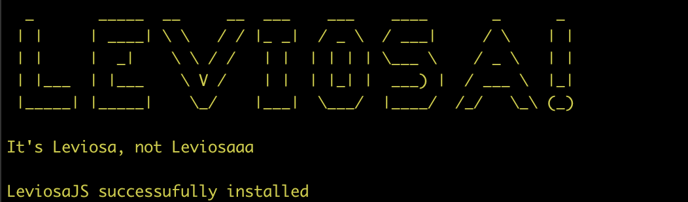
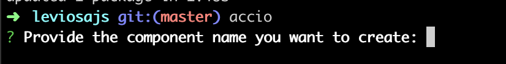

  

# It's LEVIOSA, not leviosaaah!

- This CLI helps you to bundle react components and aplications faster from the terminal. :rocket:
- Much like [create-react-app](https://github.com/facebook/create-react-app) but faster, simpler, lighter and with a few more helpers!

### Command

- `leviosa-new app` - Creates a react application with name `app` :rocket:
- `leviosa-accio header` - Creates a component with the name `header` :boom:
- `leviosa-start` - Starts the application :smiley:
- `leviosa-build` - Builds the applicaiton to production :sunglasses:

### HOW TO INSTALL

- `npm install --global leviosajs`

or using yarn

- `yarn global add leviosajs`

You're gonna see the following message:

and that's it! You're good to go.

When you use the `leviosa:accio` command

The following message will ask you to type in the name of the component you want to create:

After you typed the name of your react component and pressed `enter`, it will bundle the component within your project's folder, it will bundle an stateless component
inside `/src/components` and that's it! :smile:
